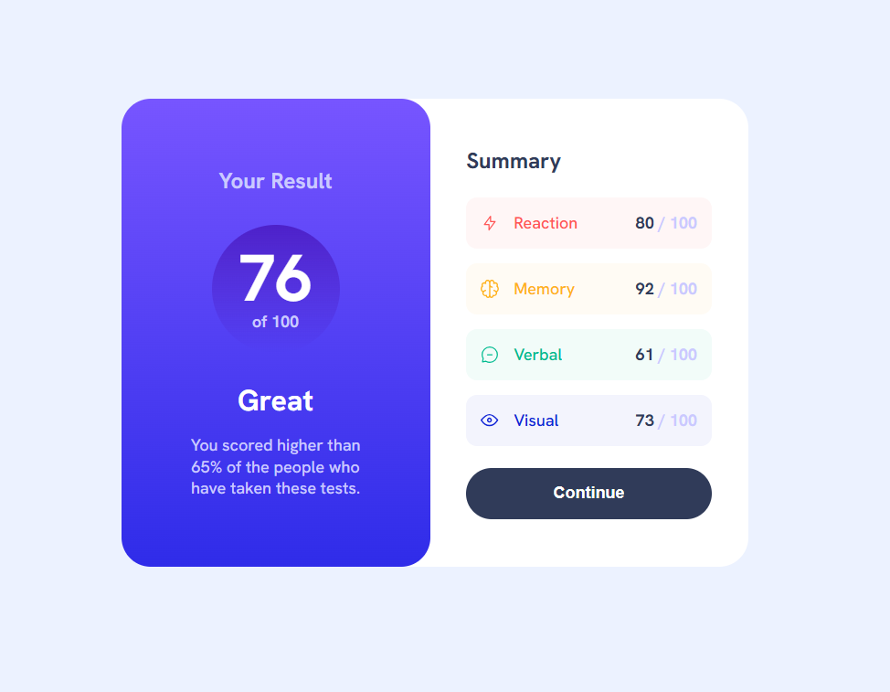

# Results summary component - Frontend Mentor

Компонент результатів (умовного) тесту з виведенням даних та оцінкою окремих аспектів.

## Навігація

- [Огляд](#огляд)
  - [Зображення](#зображення)
  - [Опис завдання](#опис-завдання)
  - [Використані технології](#використані-технології)
  
- [Висновки](#висновки)
  - [Мої досягнення](#мої-досягнення)
- [Більше про мене](#більше-про-мене)

## Огляд

### Зображення

### Опис завдання

У цьому челенджі кожен знайде щось для себе. Це проєкт, написаний лише на HTML та CSS, але ми також надали JSON-файл із результатами тестування для всіх, хто хоче попрактикуватися в JS.

Ваше завдання полягає в тому, щоб створити цей компонент зведення результатів та максимально наблизити його до дизайну.

Ви можете використовувати будь-які інструменти, які вам подобаються, щоб допомогти вам виконати челендж. Тож, якщо у вас є щось, що ви хотіли б попрактикувати, сміливо спробуйте.

Ваші користувачі повинні мати змогу:

- Переглядати оптимальний макет інтерфейсу залежно від розміру екрана свого пристрою
- Переглядати стани наведення курсора та фокусування для всіх інтерактивних елементів на сторінці
- Бонус: Використовувати локальні дані JSON для динамічного заповнення контенту

### Використані технології

- HTML5 для розмітки
- CSS3 стилізація
- Flexbox

## Висновки

Дане завдання було гарно наповнене різними підзавданнями, тож було дуже цікаво його виконувати. Бонусне завдання я не виконала, оскільки завантажений дата файл не відкривався особисто у мене. Можливо, коли я знайду рішення даної проблеми, то зможу попрактикувати і його.

### Мої досягнення

Особливих проблем з виконанням завдання не було, я знову змогла попрактикувати свої навички зі стилізацією та створенням стабільних лейаутів. Я і досі маю практикуватися з пропорціми. У своїй роботі я приділила увагу створенню спрайту іконок. Думаю, було б цікаво також виконати це завдання з залученням React та використанням clsx у ньому для відображення різних стилів динамічно, але в даному випадку я використала Vanilla підхід.

## Більше про мене

Ви можете знайти мій персональний веб-сайт з портфоліо моїх робіт за посиланням https://solvixcode.com/

- GitHub https://github.com/Olha-Fursova
- LinkedIn https://www.linkedin.com/in/olha-fursova-6727b7265/
- Frontend Mentor https://www.frontendmentor.io/profile/Olha-Fursova
- Twitch https://www.twitch.tv/solvixcode/